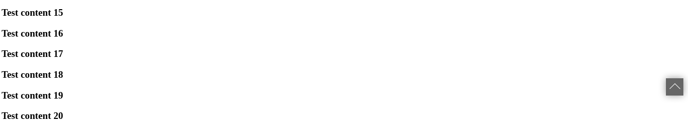

# angularjs-backtop
[](https://www.npmjs.com/package/angularjs-backtop)

> Angularjs1.x back to top plugin.(Need jQuery)



## Installtion(Just 3 steps.)
1. ```yarn add angularjs-backtop``` OR ```npm install angularjs-backtop```
2. At your root module js.
```javascript
import 'angularjs-backtop/dist/css/angularjs-backtop.css';
import 'angularjs-backtop';

// put 'AngularjsBackTop' to your root angular module.
const app = angular.module('app', ['AngularjsBackTop']);
others...
```
3. At your root index.html
```html
...
<body angularjs-back-top>
...
</body>
```
## Plan
- [ ] unneed jquery
- [ ] Could custom scroll speed
- [ ] Could custom backtop btn style